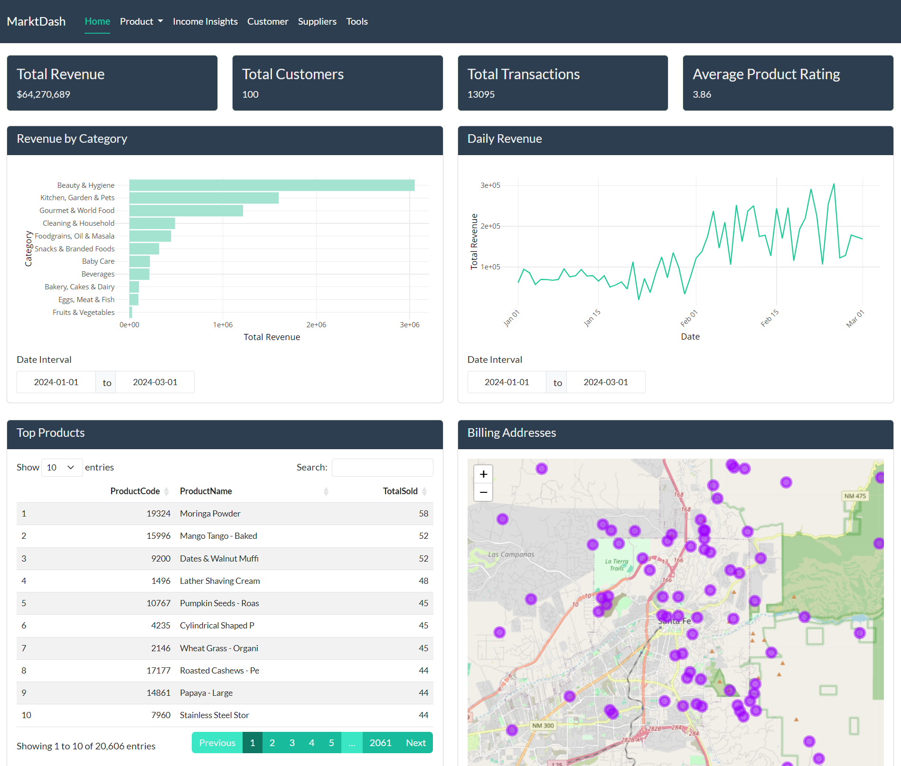
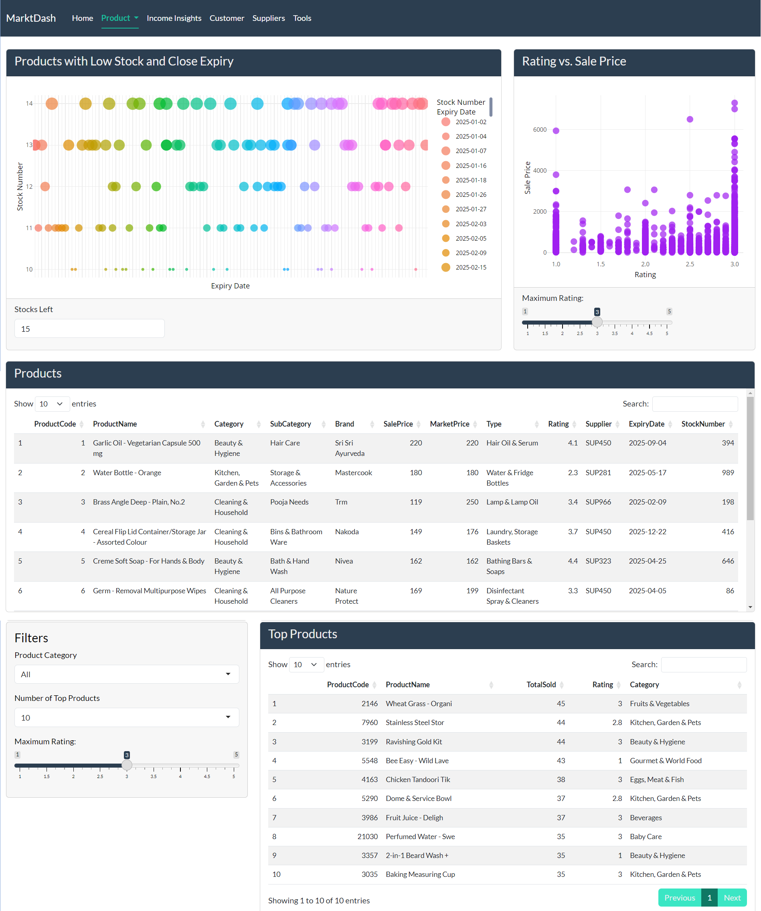
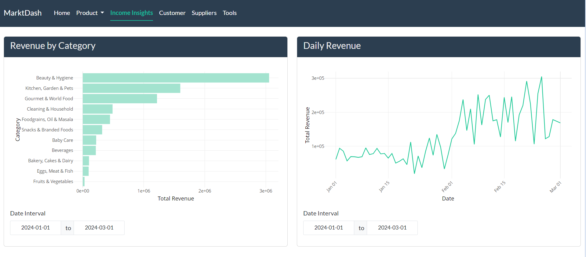
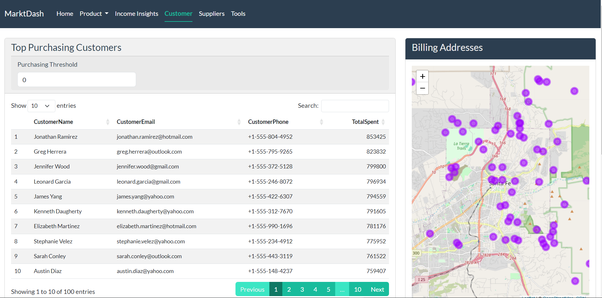
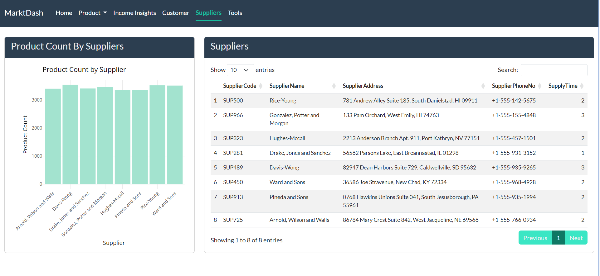
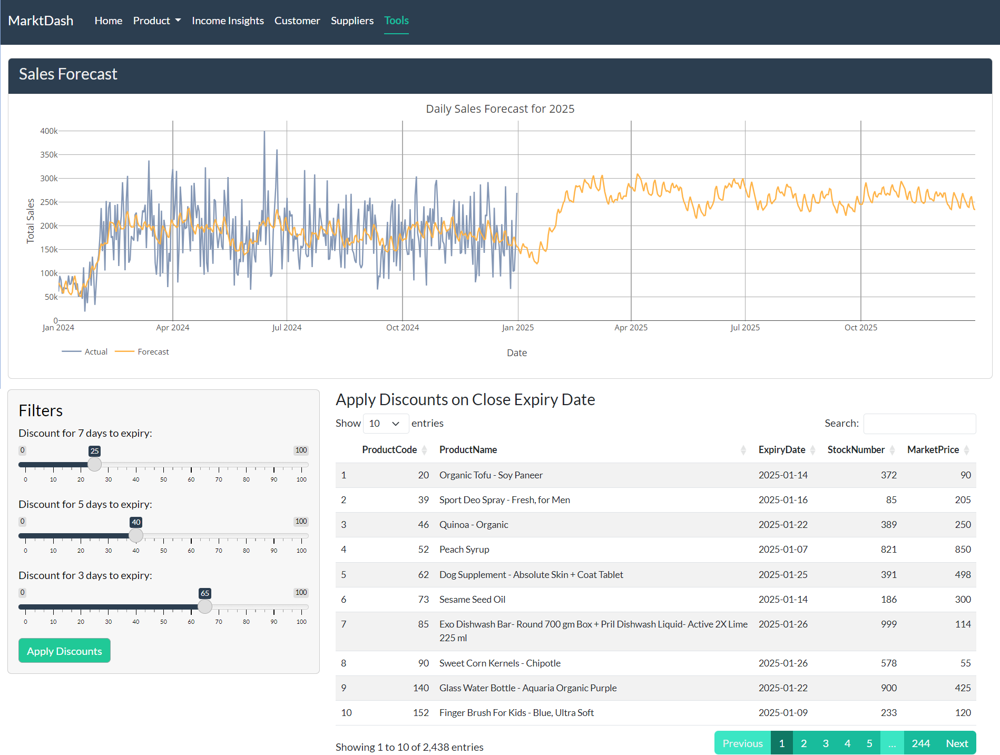
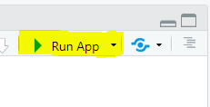
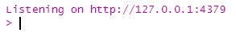

# Market Dashboard

## Overview

MarktDash is an interactive R Shiny dashboard application for visualizing market data, providing insights into revenue, customers, transactions, products and suppliers. The application uses SQLite for data gathering and `plotly`, `leaflet` and `ggplot2`. It includes a home page with brief insights, product insights, income, customer details, forecasting and solution.

## Market Database

The database simulates a supermarket data management system. It contains multiple interconnected tables representing customers, products, suppliers, transactions and transaction details. I have generated using Big Basket Grocery dataset [1] .

1.   Customers Table

    Stores customer details with location data.

    -   `CustomerID`: Unique identifier for customers.

    -   `CustomerName`: Full name of the customer.

    -   `CustomerEmail`: Email address for contact.

    -   `CustomerPhone`: Phone number for communication.

    -   `Longitude` and `Latitude`: Geographic coordinates for mapping customer locations.

    -   A sample:

    | CustomerID | CustomerName | CustomerEmail | CustomerPhone | Longitude | Latitude |
    |------------|------------|------------|------------|------------|------------|
    | CUST0001 | Mike Pacheco | mike.pacheco\@gmail.com | +1-555-176-6106 | -106.032497 | 35.636057 |
    | CUST0002 | Rhonda Yang | rhonda.yang\@yahoo.com | +1-555-217-6922 | -106.074775 | 35.597100 |

2.  Products Table

    Stores detailed information about products in the supermarket.

    -   `ProductCode`: Unique identifier for products.

    -   `ProductName`: Name or description of the product.

    -   `Category` and `SubCategory`: Classification of the product.

    -   `Brand`: Manufacturer or brand name.

    -   `SalePrice` and `MarketPrice`: Selling price and listed market price.

    -   `Type`: Additional classification of the product.

    -   `Rating`: Customer rating for the product.

    -   `Supplier`: Reference to the supplier (linked to the Suppliers table).

    -   `ExpiryDate`: Date when the product expires.

    -   `StockNumber`: Current stock level of the product.

    -   A sample:

        | ProductCode | ProductName | Category | SubCategory | Brand | SalePrice | StockNumber |
        |----|----|----|----|----|----|----|
        | 1 | Garlic Oil - Vegetarian Capsule 500 mg | Beauty & Hygiene | Hair Care | Sri Sri Ayurveda | 220.0 | 394 |
        | 2 | Water Bottle - Orange | Kitchen, Garden & Pets | Storage & Accessories | Mastercook | 180.0 | 989 |

3.  Suppliers Table

    Stores details about suppliers providing products.

    -   `SupplierCode`: Unique identifier for suppliers.

    -   `SupplierName`: Name of the supplier.

    -   `SupplierAddress`: Address of the supplier.

    -   `SupplierPhoneNo`: Contact number for the supplier.

    -   `SupplyTime`: Average supply delivery time in days.

    -   A sample:

        | SupplierCode | SupplierName | SupplierAddress | SupplierPhoneNo | SupplyTime |
        |----|----|----|----|----|
        | SUP500 | Rice-Young | 781 Andrew Alley Suite 185, ... | +1-555-142-5675 | 2 |
        | SUP966 | Gonzalez, Potter and Morgan | 133 Pam Orchard, West Emily, HI ... | +1-555-155-4848 | 3 |

4.  Transactions Table

    Records individual transactions by customers.

    -   `TransactionID`: Unique identifier for transactions.

    -   `CustomerID`: Reference to the customer making the transaction.

    -   `TransactionDate`: Date of the transaction.

    -   `TotalAmount`: Total amount for the transaction.

    -   A sample:

        | TransactionID | CustomerID | TransactionDate | TotalAmount |
        |---------------|------------|-----------------|-------------|
        | 1             | CUST0001   | 2024-01-01      | 8348.0      |
        | 2             | CUST0001   | 2024-01-01      | 597.0       |

5.  TransactionDetails Table

    Provides details about the products sold in each transaction.

    -   `TransactionID`: Reference to the transaction.

    -   `ProductCode`: Reference to the product sold.

    -   `Quantity`: Number of units sold.

    -   `UnitPrice`: Price per unit for the product.

    -   A sample:

        | TransactionID | ProductCode | Quantity | UnitPrice |
        |---------------|-------------|----------|-----------|
        | 1             | 26445       | 5        | 1499.0    |
        | 1             | 14235       | 2        | 269.0     |

## Features

### 1. Home Page

{width="540"}

-   Displays total revenue, total customers, total transactions, average product rating as information boxes.

-   Revenue by categories and daily revenue visualizations with date range 2024-01-01 to 2024-12-31.

-   Summary of top products (by total sold) and customer billing addresses shown on a map.

### 2. Product Page

{width="529"}

1.  Product Insights

    -   This page contains bubble chart of products with low stock and close expiry date, comparison plot of rating and sale prices, all products as data table and product list with rating and category filter.

2.  Add Product

    -   In this part it is possible to add a product by entering its product name, category, brand, sale price, market price, type, supplier, expiry date and stock number.

    -   The product is going to be the last product by product code, automatically increasing through products table.

### 3. Income Insights Page

{width="531"}

-   Contains horizontal histogram of top revenues by different categories and a line plot showing daily revenue over transactions.

### 4. Customer Page

{width="541"}

-   Customer page has information about top purchasing customers with their details and total spent with adjustable purchasing threshold, interactive map of billing addresses.

### 5. Suppliers Page

{width="553"}

-   Product count by supplier with histogram.

-   Data table of all suppliers.

### 6. Tools Page

{width="552"}

-   Sales forecasting using past transactions, using prophet package.

-   Apply discounts to products with close expiry dates with adjustable percentages.

## Software Requirements

1.  Programming Language : R

2.  Packages : `DT_0.33`, `bslib_0.8.0`, `prophet_1.0`, `rlang_1.1.3`, `Rcpp_1.0.12`, `dplyr_1.1.4`, `forecast_8.23.0`, `leaflet_2.2.2`, `plotly_4.10.4`, `DT_0.33`, `ggplot2_3.5.1`, `shinydashboard_0.7.2`, `fastmap_1.2.0`, `DBI_1.2.3`, `shiny_1.10.0`, `RSQLite_2.3.9`

3.  R version 4.3.3 (2024-02-29 ucrt), Platform: x86_64-w64-mingw32/x64 (64-bit), Running under: Windows 10 x64 (build 19045)

4.  Database : SQLite database file. (`data/Supermarket_up.db`)

## Installation

1.  Install R and RStudio if not already installed.

2.  Install the required R packages running the command in R console:

```         
`install.packages(c("shiny", "shinydashboard", "ggplot2", "plotly", "leaflet", "forecast", "prophet", "DBI", "RSQLite", "bslib", "dplyr", "DT"))`
```

3.  Ensure the database file is placed in `data/` directory.

## Running the App

1.  Open RStudio and set the working directory to the project folder.

2.  Run the `run.R` script to start the application:

    `runApp("run.R")`

    or click to button when you are in `run.R` file:

    {width="179"}

3.  The application will launch in R browser. If it does not, the R console will display the app URL. Copy and paste it into your browser.

    {width="242"}

## Author

Berkin Aytekin

aytekin.berkin\@gmail.com

## References

[1] 10.34740/kaggle/dsv/4100336
